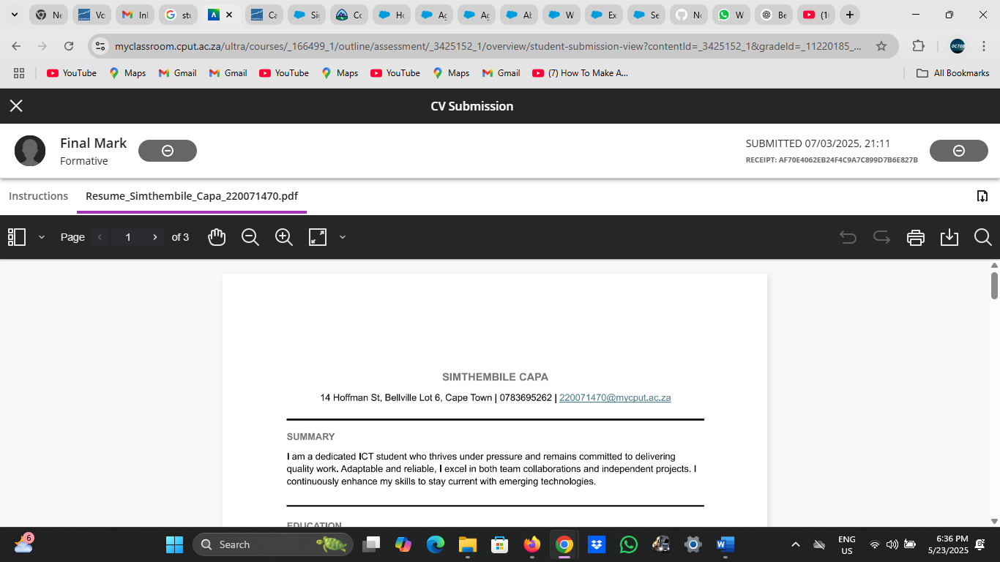

# CV Submission

As part of the Work Readiness Programme (PRP370), I was required to submit my professional CV through the university's Blackboard platform. This activity helped simulate real-world job application processes and emphasized the importance of submitting complete, polished documents on time.

---

## Submission Details

- Task: Submit CV after completion of the CV creation task  
- Platform: Blackboard  
- Date Submitted: 07 March 2025  
- Status:  Submitted successfully  

---

### Proof of Submission

Below is a screenshot confirming that I successfully uploaded my CV to Blackboard:

---

##  Reflection – STAR Technique

S – Situation
After completing my CV as part of the Work Readiness module, I had to submit it on Blackboard by the required deadline.

T – Task  
Ensure my CV was professionally written, properly formatted, and submitted through the correct channel before 07 March 2025.

A – Action  
I reviewed my CV thoroughly, made final adjustments in Markdown format, then uploaded it to Blackboard. I captured a screenshot as proof of submission.

R – Result  
I submitted my CV successfully and on time. This experience improved my readiness for real-world applications and taught me the importance of keeping submission records and managing deadlines.
