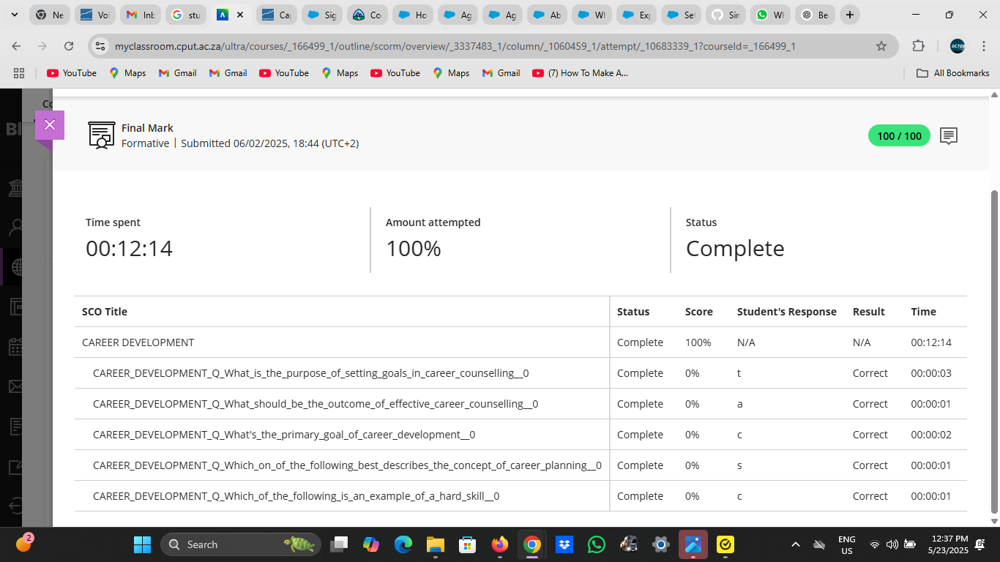

# Career Counselling

## Evidence

As part of the Work Readiness module, I completed an online career counselling assessment that helped me identify my top interest areas and suggested career paths in the ICT field. The results indicated that I have strong traits in the following areas:

- *Artistic* – I enjoy creativity, design, and expressive work, especially in front-end development.
- *Investigative* – I like solving problems and working through logic-based challenges.
- *Realistic* – I’m hands-on and enjoy building things that work efficiently.

These traits are reflected in my passion for web development, UI/UX design, and the ability to create solutions like the pizza shop app and animated SVG scenes.

Here is a screenshot of my career interest profile result:

---

## Reflection (STAR Technique)

*S – Situation*  
As part of my professional development, I needed guidance on what ICT career paths best matched my strengths and preferences.

*T – Task*  
I was required to complete a career counselling exercise to better understand where I would thrive professionally.

*A – Action*  
I completed the online assessment, reviewed the feedback, and reflected on how the results aligned with my experiences in front-end and creative development work.

*R – Result*  
The assessment confirmed my passion for development and creative problem-solving. I feel confident pursuing roles in front-end engineering, UI/UX design, or interactive web applications, which match both my skills and interests.
