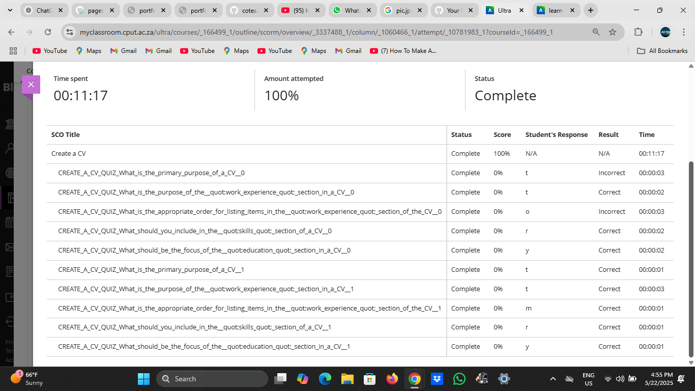

# Create CV

As part of the *Work Readiness Programme* (PRP370), I was required to create a complete and professional CV that reflects my academic background, experience, and technical capabilities. Below is my CV content in Markdown format.

---

## CV Details

Name: Simthembile  Capa
Email: capasimthembile@gmail.com  
Phone: 0783695262  
GitHub: [https://github.com/Sim-99](https://github.com/Sim-99)  
LinkedIn: in/simthembile-capa-0171461a7 (optional)

---

###  Education

Diploma in Information and Communication Technology  
Cape Peninsula University of Technology (Expected: 2025)

---

###  Work Experience

Educator Assistant 
Department of Basic Education | Nov 2020 – Mar 2021  
- Supported classroom teaching and learning  
- Assisted in managing digital and paper-based resources  
- Strengthened communication, teamwork, and adaptability skills

---

###  Projects

- Pizza E-commerce Website – Built in React with dynamic cart features and product customization  
- Library System – JavaScript-based logic for borrowing books and calculating late return fines  
- Drum Challenge – A musical interface using key press events and CSS animations  
- City Night Scene Animation – Designed in Figma and animated using CSS transitions

---

### Technical Skills

- HTML, CSS, JavaScript  
- React.js  
- Git & GitHub  
- MongoDB (basic)  
- Figma (UI Design)

---

##  Work Readiness Task: CV Creation

As evidence, below is a screenshot from the Work Readiness CV development task confirming that I participated and completed the activity:

---

##  Reflection – STAR Technique

S – Situation  
In the Work Readiness programme, we were instructed to create a professional CV that could be submitted for job or internship applications.

T – Task 
My task was to write a well-structured CV using tools provided and ensure it aligned with my field of study and career interests.

A – Action  
I drafted my CV in Markdown, reviewed it for clarity and design, and then reflected on how each section represented my progress and skills.

R – Result 
I successfully created a job-ready CV and included it in this digital portfolio. This activity helped me better understand how to present myself professionally and highlight my development in ICT.
