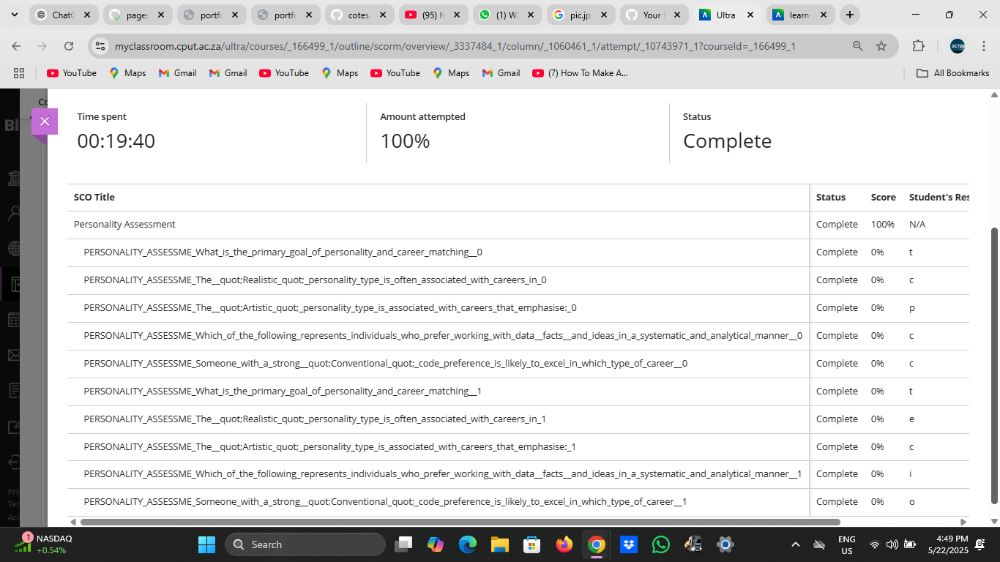

# Personality Assessment

## Evidence

As part of the project presentation work readiness module, I completed an online personality assessment. The test results revealed that I possess traits commonly associated with focused, creative, and analytical individuals  qualities that align well with careers in ICT, especially front-end development.

My results suggest that I:
- Prefer independent, structured work environments
- Excel in tasks that require attention to detail and logic
- Enjoy solving complex problems through creative approaches
- Value meaningful, impactful work
- Have a strong preference for design and building user-friendly systems

This is a screen grab of the findings from my personality test:

My approach to projects, such as designing a library system with logic for late return fines or planning and constructing an eCommerce website for pizza with editable cart capabilities, reflects these qualities.

## Reflection (STAR Technique)

*S – Situation*  
As part of the Work Readiness training programme, I was tasked with completing a personality assessment to gain insight into how my personality aligns with my future career in ICT.

*T – Task*  
I needed to analyze the results of the personality assessment and reflect on how my characteristics influence my work style, learning approach, and career choices.

*A – Action*  
After completing the online test, I reviewed my personality traits and thought about how they matched my experiences in various projects. I noticed that I enjoy working on creative challenges, such as designing intuitive interfaces and solving coding problems. I also realized that I work best when I have a clear plan and independence to execute tasks.

*R – Result*  
The assessment confirmed that I am logical, detail oriented, and creative all strengths that support my goal of becoming a professional front-end developer. It also helped me realize the importance of improving my teamwork and communication skills for collaborative environments. I now feel more confident in pursuing roles that fit my personality and skills.
