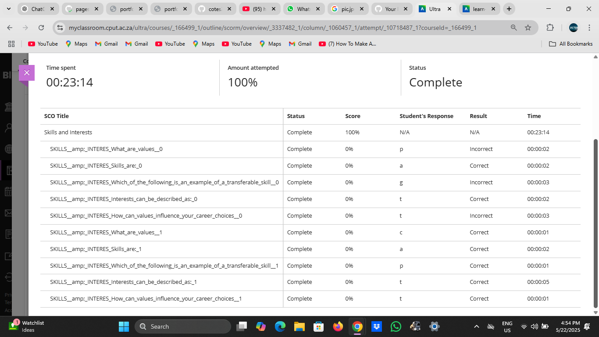

# Skills and Interests

## Evidence

I have a strong interest in *web development*, especially in front-end technologies. I enjoy building real-world applications that are interactive, visually appealing, and functional. Below are the skills I’ve developed and some of the projects I’ve completed:

### Technical Skills
- HTML & CSS
- JavaScript
- React.js
- Git & GitHub
- UI/UX Principles
- Basic MongoDB

### Projects

#### 1. *Pizza E-commerce Website* (React.js)
An interactive pizza ordering app where users can:
- View pizza sizes
- Edit pizza items (e.g., size, toppings)
- Add and remove items from the cart  
*GitHub Repo*: [https://github.com/yourusername/pizza-shop](https://github.com/yourusername/pizza-shop)  
*Live Demo*: [https://yourusername.github.io/pizza-shop](https://yourusername.github.io/pizza-shop)

---

#### 2. *Library System* (HTML, CSS, JavaScript)
This project allows users to:
- Borrow books
- Track due dates
- Automatically calculate fines for late returns  
*Live Demo*: (https://sim-99.github.io/Book-Library1/)

---

#### 3. *Drum Challenge* (HTML, CSS, JavaScript)
An interactive virtual drum set that:
- Plays sound when users press certain keys
- Shows visual feedback with CSS animations  
*Live Demo*: (https://sim-99.github.io/Drum-challenge1/)

---
#### 4. *City Night Scene Animation* (SVG + CSS)

This project was created using Figma for the SVG design and CSS animations for the glowing lights and moving vehicles. It demonstrates my ability to:
- Create custom vector graphics
- Apply smooth CSS animations
- Build creative, animated visuals suitable for landing pages or themed UI elements
  
*Live Demo*: (https://sim-99.github.io/City-night-scene-animation/)

#### Screenshot of My Skills Assessment
Here is the screenshot of my completed skills and interests task:

---

## Reflection (STAR Technique)

*S – Situation*  
As part of the PRP370 module, I needed to explore and showcase my technical skills and interests to help guide my career planning.

*T – Task*  
Demonstrate what I’ve learned practically and reflect on how these skills prepare me for a role in the tech industry.

*A – Action*  
I completed various projects that show my understanding of web development, including using HTML, CSS, JavaScript, and React. I also evaluated my own skillset through self-assessments and by analyzing the technologies I use most often.

*R – Result*  
These experiences have confirmed that I enjoy solving design and logic problems, especially in front-end development. I’m confident that my skills in building real-world web apps prepare me for internships and junior web development roles.
